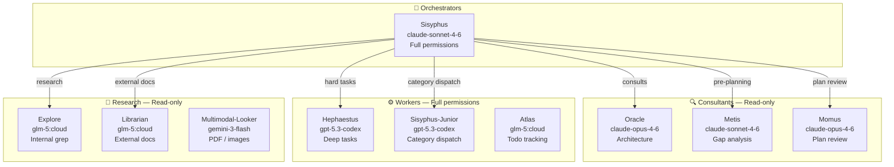
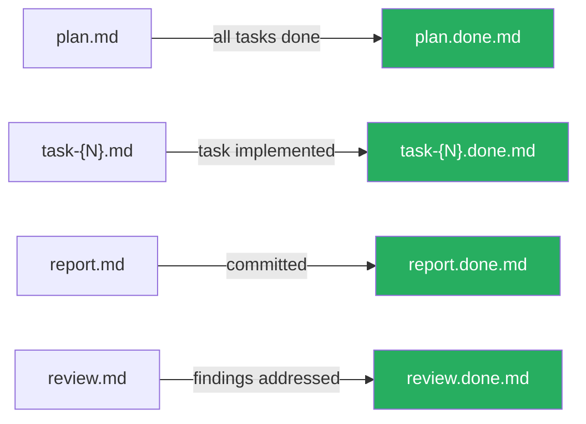
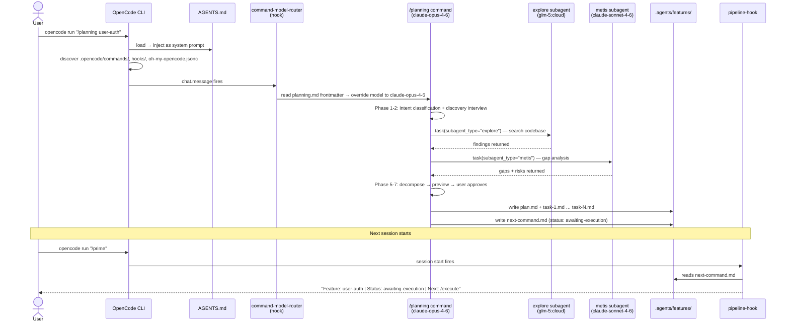

# opencode-ai-coding-system

`opencode-ai-coding-system` is a production AI coding framework built on top of OpenCode CLI.  
It turns raw AI chat sessions into a disciplined engineering workflow with planning, execution gates, review loops, and cross-session memory.

If you have used AI coding tools before, you already know the pain this solves: each session forgets context, plans drift, and code can ship without proper review. This system adds structure so work stays traceable, testable, and shippable.

---

## Why this exists

AI coding is powerful, but default usage has three recurring failures:

1. **Stateless sessions**  
   Every new session starts cold unless context is manually reconstructed.

2. **Plan drift**  
   Work often diverges from the intended design over multiple sessions.

3. **Weak quality gates**  
   Code is frequently produced quickly, then committed without systematic review.

This framework fixes those problems with:

- **Mandatory planning artifacts** in `.agents/features/{feature}/`
- **Session handoff state** in `.agents/context/next-command.md`
- **A pipeline state machine** that tracks where the feature is
- **Automated review/fix loops** before commit and PR

---

## What it is made of

The system has a clean split between static framework code and dynamic work artifacts.

- **Framework layer**: `.opencode/`  
  Commands, hooks, agent definitions, skills, and TypeScript pipeline logic.

- **Working layer**: `.agents/`  
  Generated plan/task/report/review files and the cross-session handoff file.

This separation matters because framework behavior stays stable while feature work changes continuously.

---

## The core pipeline

The full lifecycle is:

```text
/prime → /mvp → /prd → /pillars → /decompose → /planning → /execute → /code-loop → /commit → /pr
```

In practice, you run **one command per session** (except `/commit` followed by `/pr` as the final pair).  
That keeps each context window focused and prevents accidental scope bleed.

Typical feature rhythm:

- Session 1: `/prime` → `/planning {feature}` → end
- Session 2: `/prime` → `/execute plan.md` (task 1) → end
- Session 3: `/prime` → `/execute plan.md` (task 2) → end
- Session N: `/prime` → `/code-loop {feature}` → end
- Session N+1: `/prime` → `/commit` → `/pr` → end

```mermaid
flowchart LR
    A[/prime] --> B[/mvp]
    B --> C[/prd]
    C --> D[/pillars]
    D --> E[/decompose]
    E --> F[/planning]
    F --> G[/execute\ntask 1..N]
    G --> H[/code-loop]
    H --> I[/commit]
    I --> J[/pr]

    style A fill:#4A90D9,color:#fff
    style F fill:#7B68EE,color:#fff
    style G fill:#7B68EE,color:#fff
    style H fill:#E8943A,color:#fff
    style J fill:#27AE60,color:#fff
```

Session continuity is maintained by `.agents/context/next-command.md`.  
Every command updates that handoff file when it completes. `/prime` reads it and tells you exactly what to do next.

---

## Pipeline states

The TypeScript state machine tracks the pipeline using these states:

| State | Meaning |
|---|---|
| `awaiting-execution` | Plan exists and is ready for `/execute` |
| `executing-tasks` | Task briefs are being implemented |
| `executing-series` | Multi-phase execution is active |
| `awaiting-review` | All tasks done, ready for `/code-loop` |
| `awaiting-fixes` | Review found issues that must be fixed |
| `awaiting-re-review` | Fixes were applied, review must run again |
| `ready-to-commit` | Review is clean, safe to commit |
| `ready-for-pr` | Commit created, ready to open PR |
| `pr-open` | Terminal success state |
| `blocked` | Manual intervention required |

These states are not cosmetic. They gate valid next actions and reduce guesswork in long feature cycles.

```mermaid
stateDiagram-v2
    [*] --> awaiting-execution : /planning done
    awaiting-execution --> executing-tasks : /execute starts
    awaiting-execution --> executing-series : multi-phase /execute
    executing-tasks --> awaiting-review : all briefs done
    executing-series --> awaiting-review : all phases done
    awaiting-review --> awaiting-fixes : review finds issues
    awaiting-review --> ready-to-commit : review clean
    awaiting-fixes --> awaiting-re-review : fixes applied
    awaiting-re-review --> awaiting-fixes : still has issues
    awaiting-re-review --> ready-to-commit : review clean
    ready-to-commit --> ready-for-pr : /commit done
    ready-for-pr --> pr-open : /pr done
    pr-open --> [*]
    awaiting-execution --> blocked : manual intervention
    executing-tasks --> blocked : manual intervention
```

---

## Command reference

### Session start

#### `/prime`

Run this first in every session.

It loads project context and answers three questions immediately: what stack this repo uses, what state the current feature is in, and what command should run next.

It checks dirty git state, reads memory and handoff files, detects language/framework/test setup, and surfaces pending work from both the handoff file and artifact scan.

Model: `glm-5:cloud`

```bash
opencode run "/prime"
```

---

### Product foundation (run once at project start)

#### `/mvp`

Interactive discovery for the product big idea. Runs a Socratic conversation to extract, pressure-test, and articulate the product vision. Produces `mvp.md` as the compass for everything downstream.

Model: `claude-opus-4-6`

#### `/prd`

Transforms MVP direction into a full Product Requirements Document: architecture, tech stack, API contracts, data models, and implementation phases.

Model: `claude-opus-4-6`

#### `/pillars`

Extracts infrastructure pillars from the PRD and orders them with dependency gates. Tells you what must be built first and what criteria must pass before moving on.

Model: `claude-opus-4-6`

#### `/decompose`

Per-pillar deep research that produces planning-ready spec files. Run once per pillar before feature-level planning starts.

Model: `claude-opus-4-6`

---

### Feature pipeline (run for every feature)

#### `/planning {feature}`

Mandatory planning command before any implementation. It runs a structured 7-phase process:

1. **Intent classification** — what kind of work is this?
2. **Discovery interview** — Socratic questions to surface scope and constraints
3. **Codebase research** — explore/librarian agents search for patterns and integration points
4. **Design reasoning** — synthesis, dependency analysis, risk assessment, approach decision
5. **Task decomposition** — break work into atomic task briefs with wave/dependency mapping
6. **Gap analysis** — Metis agent reviews for hidden assumptions and failure modes
7. **Plan preview** — user approval gate before writing artifacts

Outputs:
- `.agents/features/{feature}/plan.md` — overview, decisions, task index
- `.agents/features/{feature}/task-{N}.md` — one brief per task, each 700+ lines, self-contained

This is a hard gate. `/execute` requires a valid planning artifact and rejects ad-hoc prompts.

#### `/execute {plan.md}`

Implements one task brief per session from the planning artifacts.

Each run detects which task brief is next (based on which `task-{N}.done.md` files already exist), implements exactly that task, writes a report, and advances the pipeline state. It will not skip ahead or implement multiple tasks in one session.

Output: `.agents/features/{feature}/report.md`

#### `/code-loop {feature}`

Automated review → fix → re-review cycle. Runs until code is clean — meaning no Critical or Major findings remain. Minor issues can be accepted explicitly.

Each iteration:
1. Runs code review and writes `review-{N}.md`
2. Applies fixes in severity order (Critical first)
3. Re-runs review
4. Continues until clean or escape condition

Model: `gpt-5.3-codex`

#### `/commit`

Creates a conventional commit (`type(scope): description`) and performs an artifact sweep — renaming `report.md` to `report.done.md` so `/prime` correctly detects the committed state next session.

Scope stages only files relevant to the current feature. `git add -A` is forbidden.

Model: `glm-5:cloud`

#### `/pr`

Creates a feature branch if needed, pushes commits, and opens a GitHub PR with a generated description from commit history and plan artifacts.

Model: `gpt-5.3-codex`

---

### Quality and review

#### `/code-review`

Technical review only. Finds bugs, security issues, and quality problems. Classifies findings as Critical (blocks commit), Major (fix before merge), or Minor (consider fixing). Reports findings — does not apply fixes.

Model: `gpt-5.3-codex`

#### `/code-review-fix {review.md}`

Applies fixes from a review file in severity order. Use when you want an explicit fix pass outside of the full `/code-loop` automation.

#### `/final-review`

Human approval gate before commit. Use it when you want a final checkpoint before shipping.

#### `/system-review`

Post-implementation meta-review. Compares the plan against the actual implementation, finds divergence, and suggests process improvements for future sessions.

Model: `gpt-5.3-codex`

#### `/council {topic}`

Multi-perspective architecture discussion for difficult technical decisions. Standalone — invoke at any point when tradeoffs are unclear and you want structured analysis before committing to an approach.

---

## Agent architecture

Agents are registered in TypeScript with explicit model assignments and permission levels.

| Agent | Model | Role | Permissions |
|---|---|---|---|
| Sisyphus | `claude-sonnet-4-6` | Main orchestrator, routing and workflow control | Full |
| Oracle | `claude-opus-4-6` | Read-only architecture consultant for hard decisions | Read-only |
| Metis | `claude-sonnet-4-6` | Pre-planning gap analyzer, finds hidden assumptions | Read-only |
| Momus | `claude-opus-4-6` | Plan quality reviewer, rejects vague plans | Read-only |
| Hephaestus | `gpt-5.3-codex` | Deep autonomous worker for logic-heavy tasks | Full |
| Sisyphus-Junior | `gpt-5.3-codex` | Category-dispatched executor for task() calls | Full (no delegation) |
| Atlas | `glm-5:cloud` | Todo and progress orchestration across sessions | Full (no delegation) |
| Explore | `glm-5:cloud` | Internal codebase grep and pattern discovery | Read-only |
| Librarian | `glm-5:cloud` | External documentation and OSS example search | Read-only |
| Multimodal-Looker | `gemini-3-flash-preview` | PDF, image, and diagram analysis | Vision-only |

Each agent is optimized for a specific job. Routing work to the right agent reduces token waste and improves output consistency. Explore and Librarian are cheap background agents — fire them in parallel for research. Oracle and Momus are expensive — use them for decisions, not grunt work.



---

## Hook system

Hooks run automatically and enforce discipline without user micromanagement.

### Tier 1: Continuation (highest priority)

- `todo-continuation` — Preserves todos across context compaction so work does not disappear mid-session
- `atlas` — Boulder state tracking for task orchestration across sessions
- `session-recovery` — Detects errors and provides recovery guidance
- `compaction-todo-preserver` — Saves todo state before context windows compact
- `background-notification` — Routes background task completion events

### Tier 2: Session

- `agent-usage-reminder` — Reminds to use Explore/Librarian before direct grep (saves tokens and gives better results)
- `command-model-router` — Routes slash commands to their configured models automatically

### Tier 3: Tool-Guard

- `rules-injector` — Injects `.opencode/rules` into every session (commit hygiene, anti-patterns, state management rules)
- `comment-checker` — Flags unnecessary AI-generated comments added to code
- `directory-agents-injector` — Injects AGENTS.md context when navigating directories
- `directory-readme-injector` — Injects directory README.md for local module context

### Tier 4: Transform

Reserved for upcoming transforms.

### Tier 5: Skill

- `category-skill-reminder` — Ensures task dispatch includes relevant skill loading

### Pipeline hook

`pipeline-hook` fires at session start, reads `next-command.md`, and emits a system reminder with the current pipeline state and next suggested command.

---

## Skills

Skills are markdown knowledge modules injected into agents via `load_skills=["skill-name"]` during task dispatch. They provide command-specific expertise and constrain agent behavior to domain-appropriate patterns.

Available skills mirror the command set:

```text
agent-browser    code-loop        code-review      code-review-fix
commit           council          decompose        execute
mvp              pillars          planning-methodology  pr
prd              prime            system-review    validation
```

---

## Directory structure

```text
opencode-ai-coding-system/
├── .opencode/                      # Framework (static, version-controlled)
│   ├── commands/                   # 15 slash command specs (*.md)
│   ├── agents/                     # Agent registry, resolver, permissions (TypeScript)
│   ├── hooks/                      # 14 hooks organized by tier (TypeScript)
│   ├── skills/                     # 16 loadable knowledge modules (*.md)
│   ├── pipeline/                   # State machine, handoff, artifact logic (TypeScript)
│   ├── config/                     # Zod schemas and category loader
│   ├── tests/                      # 512 tests (Vitest)
│   ├── rules                       # Global rules injected every session
│   └── oh-my-opencode.jsonc        # Agent and category model assignments
│
├── .agents/                        # Working artifacts (dynamic, per-feature)
│   ├── context/
│   │   └── next-command.md         # Cross-session pipeline handoff
│   └── features/{name}/
│       ├── plan.md                 # Feature plan, decisions, task index
│       ├── task-{N}.md             # Task briefs (one per /execute session)
│       ├── report.md               # Execution report
│       ├── review.md               # Code review findings
│       └── *.done.md               # Completed artifact (renamed suffix)
│
├── AGENTS.md                       # System instructions loaded by OpenCode
└── README.md
```

---

## Artifact lifecycle

Artifacts in `.agents/features/{feature}/` use a `.done.md` suffix to track completion state. This is machine-detectable, not just cosmetic — `/prime` and the pipeline logic rely on it to infer current position accurately.

```text
plan.md       →  plan.done.md        (all tasks completed)
task-1.md     →  task-1.done.md      (task implemented)
report.md     →  report.done.md      (committed)
review.md     →  review.done.md      (findings addressed)
```

If you see a file without `.done.md`, that stage is still in progress.



---

## Model assignment reference

Model mapping is defined in `.opencode/oh-my-opencode.jsonc`.

```text
Agents:
  sisyphus            ->  anthropic/claude-sonnet-4-6
  oracle              ->  anthropic/claude-opus-4-6
  momus               ->  anthropic/claude-opus-4-6
  metis               ->  anthropic/claude-sonnet-4-6
  hephaestus          ->  openai/gpt-5.3-codex
  sisyphus-junior     ->  openai/gpt-5.3-codex
  librarian           ->  ollama/glm-5:cloud
  explore             ->  ollama/glm-5:cloud
  atlas               ->  ollama/glm-5:cloud
  multimodal-looker   ->  ollama-cloud/gemini-3-flash-preview

Categories (task() dispatch):
  all categories      ->  openai/gpt-5.3-codex
```

---

## TypeScript infrastructure

Core implementation in `.opencode/`, compiled with `tsc`, tested with Vitest.

| File | Purpose |
|---|---|
| `pipeline/state-machine.ts` | 10 states, valid transitions enforced |
| `pipeline/handoff.ts` | Read/write `next-command.md` |
| `pipeline/artifacts.ts` | Discover task briefs, resolve next pending |
| `pipeline/commands.ts` | Map state to suggested next command |
| `agents/registry.ts` | Source of truth for all agent definitions |
| `agents/resolve-agent.ts` | Agent resolution with fallback chains |
| `config/category-schema.ts` | Zod validation for category dispatch config |

Status: 512 tests passing, TypeScript clean.

---

## How it all connects: OpenCode + oh-my-opencode.jsonc + hooks

This is the part most documentation skips — the actual wiring that makes the system run. Understanding it is what separates using the system from understanding it.

### OpenCode CLI is the runtime

Everything runs inside **OpenCode CLI** (`opencode run`). OpenCode is what handles model API calls, session management, tool execution, and slash command parsing. This framework is not a replacement for OpenCode — it is a configuration layer on top of it.

When you run `opencode` in this project directory, OpenCode automatically:

1. Reads `AGENTS.md` at the project root and injects it as system context for every session
2. Loads `.opencode/` as the framework configuration directory
3. Discovers slash commands from `.opencode/commands/*.md`
4. Registers hooks from `.opencode/hooks/`
5. Loads `oh-my-opencode.jsonc` for agent and category model overrides

You do not wire any of this up manually. OpenCode's convention-based discovery handles it as long as the files exist in the right places.

### AGENTS.md is the agent's brain

`AGENTS.md` at the project root is the primary system prompt. It defines:

- The agent identity (Sisyphus — the main orchestrator)
- Behavioral rules: when to plan, when to delegate, when to ask
- The intent routing map: what different user requests should trigger
- The delegation system: how `task()` calls work with categories and skills
- Every hard rule the agent must follow (never commit without asking, never suppress type errors, etc.)

Every session starts with this injected as context. It is what gives the AI its personality, discipline, and workflow knowledge. Without it, OpenCode would just be a generic AI chat tool.

### Slash commands are markdown files with frontmatter

Each file in `.opencode/commands/` is a slash command. The frontmatter at the top specifies which model it runs on:

```markdown
---
description: Prime agent with project context and auto-detect tech stack
model: ollama/glm-5:cloud
---

# Prime: Load Project Context + Stack Detection
...
```

When a user runs `/prime`, the `command-model-router` hook intercepts the message, reads the frontmatter `model:` field, and overrides the session model to `glm-5:cloud` for that command. This is how the model-tiering works automatically — cheap models for retrieval commands, expensive models for planning commands — without the user having to specify models manually.

The body of each command file is the actual instruction set the model follows when that command runs. It is not code — it is structured natural language that the model interprets as a workflow specification.

### oh-my-opencode.jsonc is the override layer

`oh-my-opencode.jsonc` in the project root is OpenCode's user configuration file. This framework uses it for two things:

**1. Agent model overrides**

```jsonc
{
  "agents": {
    "sisyphus": { "model": "anthropic/claude-sonnet-4-6" },
    "oracle":   { "model": "anthropic/claude-opus-4-6" },
    "librarian": { "model": "ollama/glm-5:cloud" }
    // ...
  }
}
```

These override the default model each named agent uses. The agent names here correspond directly to the agent definitions in `.opencode/agents/registry.ts`. When Sisyphus delegates work to Oracle via `task(subagent_type="oracle")`, OpenCode looks up `oracle` in this config and uses `claude-opus-4-6`.

**2. Category model assignments**

```jsonc
{
  "categories": {
    "quick":      { "model": "openai/gpt-5.3-codex", "provider": "openai" },
    "deep":       { "model": "openai/gpt-5.3-codex", "provider": "openai" },
    "ultrabrain": { "model": "openai/gpt-5.3-codex", "provider": "openai" }
    // ...
  }
}
```

Categories are the other delegation path. Instead of routing by agent name (`subagent_type="oracle"`), you route by domain (`category="quick"`). The category system maps task domains to models. When Sisyphus runs `task(category="quick", ...)`, OpenCode looks up `quick` in this config and routes to `gpt-5.3-codex`.

The category config is loaded and validated by `.opencode/config/load-categories.ts` using Zod schemas. Default category definitions live in code; `oh-my-opencode.jsonc` merges on top as user overrides.

### How hooks wire into the session

Hooks are TypeScript modules that OpenCode calls at specific lifecycle events. They hook into `tool.execute.before`, `tool.execute.after`, `chat.message`, and session events. The framework hooks enforce discipline automatically without user intervention:

**`rules-injector`** — When the agent reads any file (`read`, `write`, `edit` tools), this hook walks up the directory tree looking for `AGENTS.md`, `.opencode/rules`, and similar files. It appends their content to the file read output as `<injected-context>`. This means the agent always has project rules in context when it touches files, even if it did not explicitly load them.

**`command-model-router`** — Intercepts `chat.message` events. When it detects a slash command (`/prime`, `/planning`, etc.), it reads the corresponding `commands/*.md` frontmatter, extracts the `model:` field, and overrides the session model. This is the mechanism behind automatic model tiering.

**`todo-continuation`** — OpenCode compacts context windows when they get long. This hook fires before compaction, serializes the current todo list, and restores it after. Without this, in-progress task lists would disappear when context compresses.

**`category-skill-reminder`** — When the agent uses direct tools (`edit`, `write`, `bash`) instead of delegating via `task()`, this hook fires a system reminder: "You are doing delegatable work directly. Use `task(category=..., load_skills=...)` instead." This pushes the agent toward the cheaper, more appropriate delegation path.

**`agent-usage-reminder`** — Similar to category-skill-reminder. When orchestrator agents use grep or search tools directly, this hook reminds them to use the `explore` or `librarian` subagents instead. Token-efficient and higher quality.

**`pipeline-hook`** — At session start, reads `.agents/context/next-command.md` and emits a system reminder with the current pipeline state. This is what makes `/prime` able to tell you "you're at `executing-tasks`, task 2/4, run `/execute` next."

All hooks are registered through the hook registry in `.opencode/hooks/index.ts` and execute in priority tier order (Continuation → Session → Tool-Guard → Transform → Skill).

### How a task() delegation call actually works

When Sisyphus calls `task(category="deep", load_skills=["execute"], ...)`:

1. OpenCode receives the `task` tool call
2. It looks up `"deep"` in `oh-my-opencode.jsonc` categories → finds `gpt-5.3-codex` on `openai`
3. It spawns a new subagent session with that model
4. It loads the skills listed in `load_skills` — reads `execute/SKILL.md` and prepends it to the subagent's context
5. The subagent runs with the prompt, model, and skills injected
6. Results are returned to Sisyphus

The subagent is ephemeral — it exists only for that task. Skills are the knowledge it carries in. The category determines which model it runs on. This is the whole delegation system in one call.

### The full wiring diagram




This is the complete loop. OpenCode is the runtime. AGENTS.md is the brain. Commands are the workflow specs. Hooks enforce discipline automatically. `oh-my-opencode.jsonc` routes each piece of work to the right model. The `.agents/` directory carries state between sessions.

---

## Running commands

Interactive mode is recommended for conversational commands like `/planning`, `/mvp`, and `/prd`.

```bash
# Open interactive TUI from project directory
opencode

# One-shot run
opencode run --model anthropic/claude-sonnet-4-6 "your message"

# One-shot with explicit working directory
opencode run --dir "/path/to/project" --model anthropic/claude-sonnet-4-6 "your message"

# Run a slash command directly
opencode run "/prime"
opencode run "/planning user-auth"
opencode run "/execute .agents/features/user-auth/plan.md"
```

---

## Getting started

Use this exact sequence for a new project adopting the framework.

**Step 1: Start every session with /prime**

```bash
opencode run "/prime"
```

**Step 2: Define product direction (once per project)**

```bash
opencode run "/mvp"
opencode run "/prd"
opencode run "/pillars"
```

**Step 3: Research each pillar**

```bash
opencode run "/decompose <pillar-name>"
```

Repeat for each pillar in dependency order.

**Step 4: Plan a feature**

```bash
opencode run "/planning user-auth"
```

Go through the interactive interview. Approve the plan preview when it looks right.

**Step 5: Execute task briefs (one per session)**

```bash
opencode run "/execute .agents/features/user-auth/plan.md"
```

Run this across multiple sessions until all task briefs are complete. The system picks the next undone brief automatically.

**Step 6: Run the review loop**

```bash
opencode run "/code-loop user-auth"
```

**Step 7: Commit and open PR**

```bash
opencode run "/commit"
opencode run "/pr"
```

---

## How a feature gets built — end to end

Assume feature name: `user-auth`.

**Session 1**
- Run `/prime`
- Run `/planning user-auth`
- System runs discovery interview, researches codebase, reasons through design, generates plan
- Output: `plan.md` + `task-1.md` through `task-N.md`
- Handoff written: next command is `/execute`

**Sessions 2 through N (one per task brief)**
- Run `/prime` — handoff surfaces next task
- Run `/execute .agents/features/user-auth/plan.md`
- System detects next undone brief, implements exactly that task
- `task-{N}.md` renamed to `task-{N}.done.md`
- Handoff updated

**Review session**
- Run `/prime`
- Run `/code-loop user-auth`
- Loop reviews, fixes, re-reviews until clean
- Pipeline state advances to `ready-to-commit`

**Ship session**
- Run `/prime`
- Run `/commit`
- Run `/pr`
- Pipeline reaches `pr-open`

Each session has a deterministic next action. The handoff file carries continuity so you never need to remember where you left off.

---

## How to think about this system

The fastest way to use this framework well is to treat it like a CI pipeline for AI sessions:

- Planning artifacts are the source of truth for what gets built
- The handoff file is the session bridge — do not edit it manually
- The state machine is the traffic controller — it tells you what is valid next
- The review loop is the safety net — nothing ships until it is clean

Follow that model and AI work stops feeling like ad hoc chat. It becomes reproducible engineering.

---

## Quick reference

```text
Always first:      /prime

Project setup:     /mvp -> /prd -> /pillars -> /decompose

Per feature:
  Plan:            /planning {feature}
  Execute:         /execute .agents/features/{feature}/plan.md   (repeat per task)
  Review:          /code-loop {feature}
  Ship:            /commit  then  /pr

Quality tools:
  /code-review
  /code-review-fix {review.md}
  /final-review
  /system-review
  /council {topic}
```
