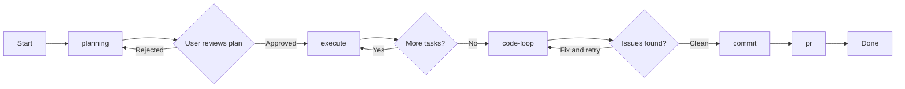
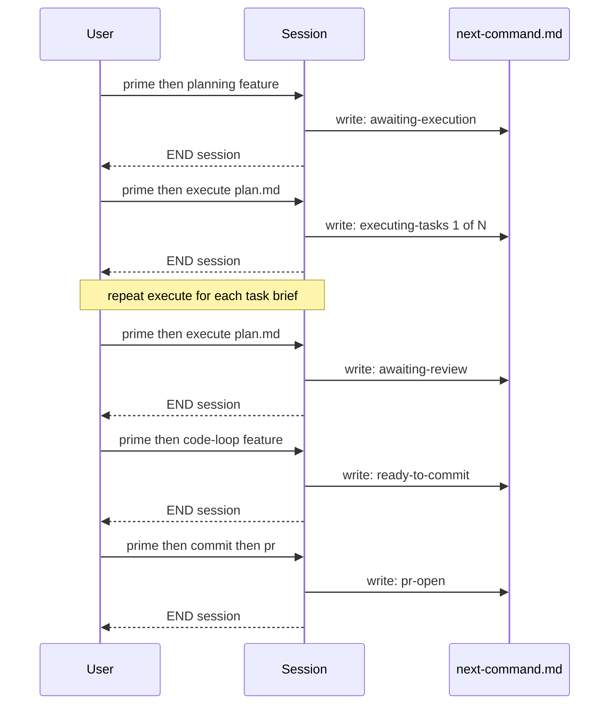
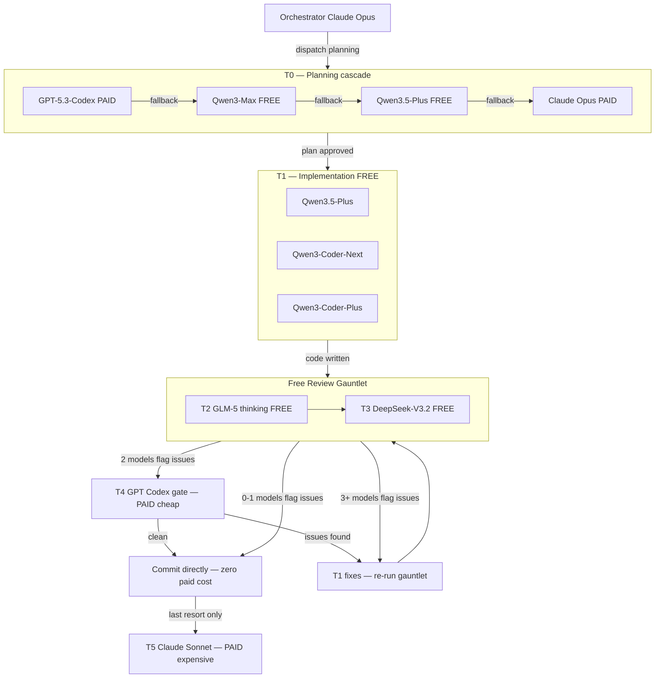
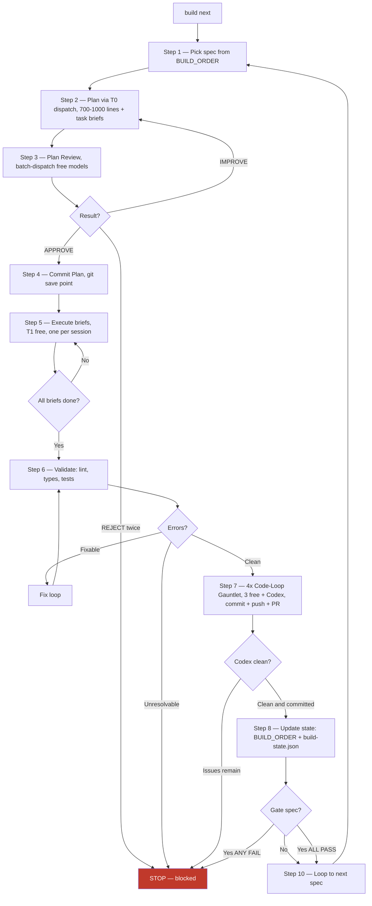
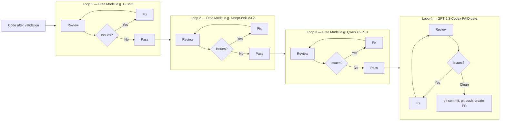
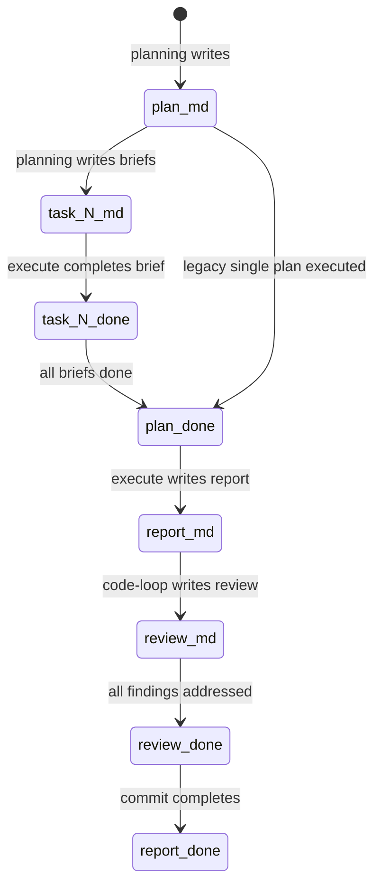

# OpenCode AI Coding System

A production-grade AI-assisted development framework built on top of [OpenCode](https://opencode.ai). Implements a structured **PIV Loop** (Plan → Implement → Validate), a **5-tier cost-optimized model cascade**, and a **fully autonomous build pipeline** that orchestrates planning, execution, code review, and commits across multiple AI models — mostly free.

---

## What This Is

This is not a prompt collection. It is a complete development operating system for AI-assisted engineering with:

- **19 slash commands** covering the full development lifecycle
- **5 specialized sub-agents** for parallel research and plan writing
- **4 TypeScript orchestration tools** for multi-model dispatch, batch comparison, council discussion, and benchmarking
- **A structured methodology** with enforced planning discipline, 5-level validation, and state management across sessions
- **Archon MCP integration** for persistent task tracking and RAG-powered knowledge retrieval

---

## Core Methodology

### PIV Loop: Plan → Implement → Validate

Every feature, fix, or change follows this loop. No exceptions.

```
/planning → user reviews → /execute → /code-loop → /commit → /pr
```



**Hard rules:**
- `/planning` MUST run before any code is written. Always.
- The plan MUST be reviewed and approved by the user before `/execute` runs.
- Validation runs at every level: syntax → types → unit tests → integration → human review.
- Claude Opus (orchestrator) never writes code directly. All implementation is dispatched to T1–T5 models. If dispatch is unavailable, the primary session model implements.

### Context Engineering (4 Pillars)

Every structured plan must address:

| Pillar | What It Covers |
|--------|---------------|
| **Memory** | Session conversation (short-term) + `memory.md` (long-term, read at `/prime`, updated at `/commit`) |
| **RAG** | External docs and library references via Archon MCP knowledge base |
| **Prompt Engineering** | Explicit, assumption-free instructions in plans |
| **Task Management** | Step-by-step atomic tasks synced to Archon, tracked with `.done.md` artifacts |

### Session Model

Each session is one context window. The system is designed around this:

```
Session 1:  /prime → /planning {feature}             → END
Session 2:  /prime → /execute plan.md                → END (task 1)
Session 3:  /prime → /execute plan.md                → END (task 2)
Session N:  /prime → /code-loop {feature}            → END
Session N+1:/prime → /commit → /pr                   → END
```



State is passed between sessions via `.agents/context/next-command.md` (the pipeline handoff file). `/prime` reads it at session start to tell you exactly what to run next.

---

## 5-Tier Model Cost Cascade

The system routes tasks to the cheapest capable model. Paid models are used only when free models disagree or fail.

| Tier | Role | Models | Cost |
|------|------|--------|------|
| T0 | Planning | GPT-5.3-Codex → Qwen3-Max → Qwen3.5-Plus → Claude Opus | PAID → FREE → PAID |
| T1 | Implementation | Qwen3.5-Plus, Qwen3-Coder-Next, Qwen3-Coder-Plus | FREE |
| T2 | First validation | GLM-5 (thinking model) | FREE |
| T3 | Second validation | DeepSeek-V3.2, Kimi-K2, Gemini-3-Pro | FREE |
| T4 | Code review gate | GPT-5.3-Codex | PAID (cheap) |
| T5 | Final review | Claude Sonnet-4-6 | PAID (expensive, last resort) |

**Smart escalation**: After a 3–5 model free gauntlet, paid models are only triggered when 2+ free models find issues. When 0–1 find issues, commit directly — zero paid cost.



---

## Directory Structure

```
opencode-ai-coding-system/
│
├── AGENTS.md                          ← Root instructions (auto-loaded)
│
├── .opencode/                         ← Framework configuration
│   ├── commands/                      ← 19 slash commands
│   ├── agents/                        ← 5 specialized sub-agents
│   ├── tools/                         ← 4 TypeScript orchestration tools
│   ├── sections/                      ← Auto-loaded rule modules
│   ├── templates/                     ← Plan and report templates
│   ├── reference/                     ← On-demand guides
│   ├── skills/                        ← Planning methodology skill
│   └── config.md                      ← Project configuration (stack, validation commands)
│
├── .claude/
│   └── commands/                      ← Mirror of .opencode/commands/ for Claude Code
│
└── .agents/                           ← Generated runtime artifacts
    ├── context/
    │   └── next-command.md            ← Pipeline handoff (read by /prime)
    ├── features/{name}/               ← Per-feature artifacts
    │   ├── plan.md                    ← Feature overview + task index
    │   ├── task-{N}.md               ← Self-contained task briefs
    │   ├── report.md                  ← Execution report
    │   ├── review-{N}.md             ← Code review artifacts
    │   └── loop-report-{N}.md        ← Code-loop iteration reports
    └── specs/                         ← Build pipeline state
        ├── BUILD_ORDER.md             ← Ordered spec list with dependencies
        ├── PILLARS.md                 ← Pillar definitions and gate criteria
        └── build-state.json           ← Cross-session build progress
```

---

## Slash Commands

### Session Management

| Command | Description |
|---------|-------------|
| `/prime` | Load project context at session start. Detects tech stack, reads handoff file, surfaces pending work. Always run this first. |

### Planning Pipeline

| Command | Description |
|---------|-------------|
| `/planning {feature}` | Interactive discovery session: explore ideas → synthesize → analyze → decide → decompose → write 700-1000 line plan + task briefs. Supports `--auto-approve` for autonomous mode. |
| `/execute {plan.md}` | Implement from a `/planning` artifact. Auto-detects task brief mode vs master plan mode. Executes ONE brief per session. Writes execution report and `.done.md` markers. |
| `/code-loop {feature}` | Automated review → fix → review loop until clean. Dispatches multi-model review, applies fixes via `/code-review-fix`, runs validation at each iteration. |
| `/commit` | Conventional commit with auto-detected scope, type, and breaking change detection. Writes `ready-for-pr` handoff. |
| `/pr {feature}` | Create GitHub PR from feature commits with structured body (what, validation, files changed). |

### Autonomous Build Pipeline

| Command | Description |
|---------|-------------|
| `/build [next \| spec-id]` | Fully autonomous spec builder. Picks specs from `BUILD_ORDER.md` and runs the full pipeline: Plan → Plan Review → Commit Plan → Execute → Validate → 4x Code-Loop Gauntlet → Push + PR → Gate Check → Loop. Stops only on gate failure or error. |
| `/mvp` | Generate PRD scaffold and project foundation. Starting point for new projects. |
| `/prd` | Structured Product Requirements Document creation. |
| `/pillars` | Define architectural pillars (groups of related specs with gate criteria). |
| `/decompose` | Break PRD into ordered specs in `BUILD_ORDER.md` with dependencies and depth labels (light/standard/heavy). |
| `/ship` | Final release validation after all pillars are complete. |

### Code Quality

| Command | Description |
|---------|-------------|
| `/code-review` | Technical code review producing a structured artifact with Critical/Major/Minor findings. |
| `/code-review-fix {review.md}` | Apply fixes from a code review artifact by severity order. Supports `critical+major`, `all`, `critical` scopes. |
| `/code-loop {feature}` | Full automated fix loop (see Planning Pipeline above). |
| `/final-review` | Human approval gate before commit. Optional step for manual sign-off. |
| `/system-review` | Divergence analysis — compares implementation against plan, flags plan gaps and execution issues. |

### Utilities

| Command | Description |
|---------|-------------|
| `/council {topic}` | Multi-model discussion (3–10 models). Models see each other's responses and can rebut. Returns raw outputs first, synthesis after user acknowledgment. |
| `/sync` | Check Archon MCP sync status for the current project. |

---

## The Build Pipeline (`/build`)

`/build` is the fully autonomous core of the system. Run it once; it builds until done.

```
/mvp → /prd → /pillars → /decompose → /build next → /ship
```

### Pipeline Steps (per spec)

```
Step 1: Pick next spec from BUILD_ORDER.md
Step 2: Plan (700-1000 line plan + task briefs via T0 dispatch)
Step 3: Plan Review (multi-model batch review — APPROVE / IMPROVE / REJECT)
Step 4: Commit Plan (git save point before any implementation)
Step 5: Execute all task briefs (T1 free models, one brief per dispatch session)
Step 6: Validate (lint → types → unit tests → integration tests; classify fixable vs unresolvable)
Step 7: 4x Code-Loop Gauntlet (3 free models + Codex gate → commit + push + PR)
Step 8: Update state (BUILD_ORDER checkboxes, build-state.json, Archon tasks)
Step 9: Gate check (if this spec is a pillar gate — run acceptance criteria)
Step 10: Loop to next spec (zero interaction between specs)
```



### The 4x Code-Loop Gauntlet

The quality gate before every commit:

```
Loop 1 (free model)  → review + fix
Loop 2 (free model)  → review + fix
Loop 3 (free model)  → review + fix
Loop 4 (GPT Codex)   → review + fix + commit + push (paid gate)
```



Model lineup is pulled from `model-scores.json` if a benchmark has been run, otherwise uses default free models (GLM-5, DeepSeek-V3.2, Qwen3.5-Plus). Loop 4 is always Codex.

### Stop Conditions

| Condition | Behavior |
|-----------|----------|
| Gate PASSED | Auto-continue to next pillar |
| Gate FAILED | STOP — report which criteria failed |
| Unresolvable error | STOP — after max retries |
| All specs complete | STOP — run `/ship` |
| User interrupts (Ctrl+C) | STOP — save checkpoint |

Every stop writes `.agents/context/next-command.md`. `/prime` reads it on next session start.

---

## Orchestration Tools

Four TypeScript tools in `.opencode/tools/` enable multi-model orchestration via `opencode serve` (runs locally at `http://127.0.0.1:4096`).

### `dispatch.ts`

Route a prompt to any single AI model with 27 pre-defined task types.

```
dispatch({
  taskType: "code-review",          // auto-routes to GLM-5 (T2a thinking)
  prompt: "Review this for bugs: ..."
})

dispatch({
  mode: "agent",                    // gives model full file access
  provider: "bailian-coding-plan-test",
  model: "qwen3.5-plus",
  prompt: "Implement X. Read existing code first. Run ruff/mypy after."
})
```

**Three modes:**
- `text` — prompt in, text out (reviews, analysis, no tools)
- `agent` — full file read/write, bash, grep, glob access (implementation tasks)
- `command` — run a slash command (`/planning`, `/execute`, `/code-review`)

**Sequential dispatch (same session):**
```
result1 = dispatch({ mode: "command", command: "prime", ... })
result2 = dispatch({ mode: "command", command: "planning", ..., sessionId: result1.sessionId })
```

### `batch-dispatch.ts`

Send the same prompt to multiple models in parallel and compare responses.

10 pre-defined batch patterns:

| Pattern | Models | Use Case |
|---------|--------|----------|
| `free-review-gauntlet` | GLM-5, GLM-4.5, Qwen3-Coder-Plus, GLM-4.7-Flash, DeepSeek-V3.2 | 5-model consensus review |
| `free-impl-validation` | GLM-5, GLM-4.7-Flash, DeepSeek-V3.2 | Quick 3-model check after implementation |
| `free-plan-review` | GLM-5, GLM-4.5, Qwen3-Max, DeepSeek-V3.2 | 4-model plan critique |
| `free-security-audit` | GLM-4.7-Flash, GLM-5, Qwen3-Coder-Plus | Security-focused review |
| `free-heavy-architecture` | GLM-4.5, Qwen3-Max, Kimi-K2, DeepSeek-V3.1:671B, Cogito | Architecture decisions |
| `free-regression-sweep` | GLM-4.7, Qwen3-Coder-Plus, Devstral-2 | Regression check |
| `multi-review` | GLM-5, GLM-4.5, DeepSeek-V3.2, Kimi-K2-Thinking | Multi-family code review |
| `plan-review` | GLM-5, Qwen3-Max, Qwen3.5:397B, DeepSeek-V3.2 | Plan critique |
| `pre-impl-scan` | GLM-4.7-Flash, Qwen3-Coder-Next, DeepSeek-V3.2 | Pre-implementation pattern scan |
| `heavy-architecture` | GLM-4.5, Qwen3-Max, Kimi-K2, DeepSeek-V3.1:671B, Cogito | Deep architecture review |

**Smart escalation from batch output:**
- `escalationAction: skip-t4` → 0–1 models found issues → commit directly, $0 paid cost
- `escalationAction: run-t4` → 2 models found issues → run T4 tiebreaker
- `escalationAction: fix-and-rerun` → 3+ models found issues → fix loop, re-run gauntlet

### `council.ts`

Multi-model discussion where models see each other's responses.

```
/council "Should we use event sourcing or direct DB updates for this feature?"
```

- Default: 4–5 models auto-selected for provider diversity
- Models see prior responses and can rebut
- Structured or freeform modes
- Max 1 council per question (no spam)
- Raw outputs presented first; synthesis only after user acknowledgment

### `benchmark.ts`

Benchmark all ~20 free models against a standardized code review diff with known ground-truth issues. Auto-generates `codeLoopLineup` in `model-scores.json` — the ranked lineup used by `/build`'s gauntlet.

---

## Sub-Agents

Five specialized sub-agents used during `/planning`:

| Agent | Type | Purpose |
|-------|------|---------|
| `plan-writer` | `plan-writer` | Writes 700-1000 line plan.md and task-{N}.md briefs from Phase 3 context handoff |
| `research-codebase` | `explore` | Deep codebase exploration — file patterns, integration points, naming conventions, gotchas |
| `research-external` | `explore` | External doc research via Archon RAG or WebFetch — best practices, API docs, compatibility notes |
| `planning-research` | `explore` | Cross-session pattern search — completed plans, Archon knowledge base, reusable structures |
| `code-review` | `code-review` | Technical code review producing structured Critical/Major/Minor findings |

Agents run in parallel (three research agents launched simultaneously in Phase 2 of `/planning`).

---

## State Management: The `.done.md` Pattern

State is tracked via file renaming, not database records:

| Artifact | Created By | Marked `.done.md` By | Trigger |
|----------|-----------|---------------------|---------|
| `plan.md` | `/planning` | `/execute` | All task briefs done |
| `task-{N}.md` | `/planning` | `/execute` | Task brief fully executed |
| `plan-master.md` | `/planning` | `/execute` | All phases completed |
| `report.md` | `/execute` | `/commit` | Changes committed |
| `review.md` | `/code-review` | `/commit` or `/code-loop` | All findings addressed |
| `loop-report-{N}.md` | `/code-loop` | `/code-loop` | Clean exit |

**Why this works**: Any session can determine pipeline state by scanning for `task-{N}.done.md` files. No database, no shared state. If a session crashes mid-execution, the brief wasn't renamed, so the next session retries it automatically.



---

## Pipeline Handoff File

`.agents/context/next-command.md` is the session bridge. Every pipeline command overwrites it on completion:

```markdown
# Pipeline Handoff
- **Last Command**: /execute (task 2 of 4)
- **Feature**: user-auth
- **Next Command**: /execute .agents/features/user-auth/plan.md
- **Task Progress**: 2/4 complete
- **Timestamp**: 2026-03-02T09:30:00Z
- **Status**: executing-tasks
```

`/prime` reads this at session start and surfaces it as pending work. The user just runs `/prime` — the system tells them exactly what to run next.

**Status values:**

| Status | Meaning | Next Step |
|--------|---------|-----------|
| `awaiting-execution` | Plan written, execution not started | `/execute plan.md` |
| `executing-tasks` | Task brief mode in progress | `/execute plan.md` (auto-detects next task) |
| `executing-series` | Master plan phase in progress | `/execute plan-master.md` |
| `awaiting-review` | All execution done | `/code-loop {feature}` |
| `awaiting-fixes` | Review found issues | `/code-review-fix review.md` |
| `ready-to-commit` | Review clean | `/commit` |
| `ready-for-pr` | Committed | `/pr {feature}` |
| `build-loop-continuing` | `/build` committed and continuing | `/build next` (auto) |
| `blocked` | Manual intervention required | See Next Command field |

---

## Planning Artifacts

### Task Brief Mode (Default)

For most features. Produces one brief per task, each brief is one `/execute` session:

```
.agents/features/{feature}/
├── plan.md          ← 700-1000 lines: overview, research, patterns, task index
├── task-1.md        ← 700-1000 lines: self-contained execution doc for task 1
├── task-2.md        ← self-contained execution doc for task 2
└── task-{N}.md
```

**Key requirements:**
- Plans must be 700-1000 lines (enforced — rejected if under 700)
- Task briefs must be self-contained: no "see plan.md" references
- Code samples must be copy-pasteable, not summaries
- Every step includes exact current content + replacement content blocks

### Master Plan Mode (Escape Hatch)

For architecturally complex multi-phase features:

```
.agents/features/{feature}/
├── plan-master.md      ← ~400-600 lines: phases, dependencies, cross-phase decisions
├── plan-phase-1.md     ← 700-1000 lines: phase 1 execution doc
├── plan-phase-2.md     ← 700-1000 lines: phase 2 execution doc
└── plan-phase-{N}.md
```

---

## Archon MCP Integration

[Archon](https://github.com/coleam00/archon) is an optional MCP server providing:

- **Persistent task tracking** — Kanban board visible in real-time; tasks sync from `/planning` and update during `/execute`
- **RAG knowledge base** — curated documentation indexed and searchable with 2-5 keyword queries
- **Cross-session project memory** — task history and project state survive between sessions

**Archon-first rule**: When Archon is connected, use it for ALL task management. Never use TodoWrite when Archon is available.

**Task lifecycle:**
```
todo → doing → review → done
```
Only ONE task in `doing` status at a time. Archon enforces this.

**RAG usage** (short queries work best):
```python
rag_search_knowledge_base(query="authentication JWT", match_count=5)
rag_search_code_examples(query="React hooks", match_count=3)
```

**Endpoint**: `http://159.195.45.47:8051/mcp`  
**Status**: Optional — all commands degrade gracefully if unavailable.

---

## Validation Pyramid

The system enforces 5-level validation at every execution step:

| Level | What | When |
|-------|------|------|
| L1 Lint | Syntax and style | After every file change |
| L2 Types | Type safety | After implementation |
| L3 Unit Tests | Function-level correctness | After implementation |
| L4 Integration Tests | Cross-component behavior | Before commit |
| L5 Manual | Human verification | At `/final-review` |

Configured in `.opencode/config.md`. Auto-detected by `/prime` from project files (eslint, tsconfig, pytest, vitest, etc.).

---

## Interference Protection

Any dispatched model that writes to protected paths is automatically reverted and disqualified:

**Protected paths:**
- `.opencode/` — framework configuration
- `.claude/` — Claude Code mirror
- `.agents/specs/` — build pipeline state
- `AGENTS.md`, `CLAUDE.md` — root instructions

This prevents implementation models from corrupting the framework while editing codebases.

---

## Backward Repair

If implementing spec N reveals that a completed spec M needs changes:

- **Minor** (1-2 files, no API changes): Autonomous patch with inline plan
- **Moderate** (3+ files, no architecture change): Autonomous with extra caution
- **Architectural** (3+ specs affected or API surface changes): STOP, surface to user

Repairs get their own conventional commit scoped to spec M. Maximum 1 backward repair per spec execution — if more are needed, the dependency graph has a problem.

---

## Context Compaction Recovery

If a session hits its context limit mid-execution, recovery is automatic:

1. Read `build-state.json` — check `currentSpec` and `currentStep`
2. Read `.agents/context/next-command.md` — get latest handoff
3. Resume from the checkpoint:
   - Steps 1-4 (plan): Check git log for plan commit, resume at step 5 if committed
   - Step 5 (execute): Scan `task-{N}.done.md` files, resume with remaining briefs
   - Step 6 (validate): Re-run validation — idempotent
   - Step 7 (code-loop): Check git log for code commit, re-run if not committed
   - Step 8+ (update state): Re-check BUILD_ORDER, resume from last incomplete step

---

## Configuration

`.opencode/config.md` — override any auto-detected value:

```markdown
## Stack
- Language: TypeScript
- Framework: Next.js
- Package Manager: pnpm

## Validation Commands
- L1 Lint: npx eslint .
- L2 Types: npx tsc --noEmit
- L3 Unit Tests: npx vitest run
- L4 Integration Tests: npx vitest run --reporter=verbose integration/

## Model Tiers (Optional)
- T1 (Fast/Free): bailian-coding-plan-test/qwen3.5-plus
- T4 (Premium): openai/gpt-5.3-codex
- T5 (Top-Tier): anthropic/claude-sonnet-4-6
```

---

## Reference Guides

On-demand guides in `.opencode/reference/` — load when needed:

| Guide | When to Use |
|-------|------------|
| `model-strategy.md` | Dispatching models, configuring routing, debugging tiers |
| `validation-discipline.md` | Deep dive on the 5-level validation pyramid |
| `piv-loop-practice.md` | Full PIV methodology with examples |
| `implementation-discipline.md` | `/execute` command patterns and guardrails |
| `command-design-framework.md` | Creating new slash commands |
| `system-foundations.md` | Core architecture overview |
| `layer1-guide.md` | Building AGENTS.md / CLAUDE.md for new projects |

---

## Dual Compatibility

All 19 slash commands are mirrored in `.claude/commands/` for use with Claude Code (the Anthropic CLI). The `.opencode/commands/` versions are for the OpenCode tool. Both run identical command logic.

---

## Requirements

- [OpenCode](https://opencode.ai) with `opencode serve` running (for multi-model dispatch)
- `git` and `gh` CLI (for commits and PR creation)
- Node.js / Bun (for TypeScript tools in `.opencode/tools/`)
- Archon MCP server (optional — for RAG and task tracking)
- Model provider API keys as configured in your OpenCode setup

---

## Getting Started

1. Clone this repo into your project as a sibling or copy the `.opencode/` directory into your project root.
2. Run `/prime` to load context and detect your tech stack.
3. Start with `/mvp` for a new project, or `/planning {feature}` for an existing one.
4. Follow the handoff file — `/prime` tells you exactly what to run next in every session.

For the full autonomous experience:
```
/prime
/mvp
/prd
/pillars
/decompose
/build next
```

Then let it run. It stops when done or when something needs your attention.
